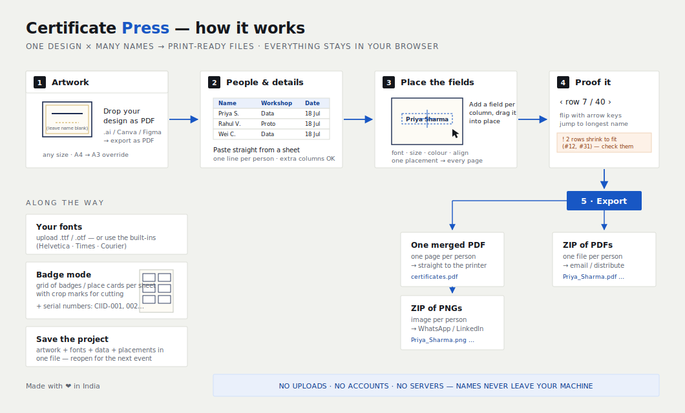

# Certificate Press

**One design × many names → print-ready files.** Put names — and any other
changing details — onto your own artwork: certificates, name badges, place
cards, invitations, tickets, ID cards. Runs **entirely in your browser**.
No accounts, no uploads, no servers. Made with ❤️ in India · works even when
the WiFi doesn't.

## Features

### Your artwork
- Load **any design as a PDF** — export from Illustrator, Canva, Figma,
  InDesign… Leave the personalised spots blank; the app draws on top.
- Any page size. Detected size shown in mm, with **override presets**
  (A4/A3/Letter, portrait/landscape) or fully custom dimensions.
- Multi-page PDFs use page 1.

### Your data
- **Paste straight from a spreadsheet** — one person per line; tab-separated
  columns (a normal spreadsheet paste) and CSV both parse automatically.
- Optional **heading row** that names your columns throughout the app.
- Live row and column counts as you paste.

### Fields
- **Unlimited fields** — Name, Workshop, Date, Seat, ID… each reads one column.
- **Serial numbers** — any field can auto-number (001, 002…) with an optional
  prefix like `CIID-`, no data column needed.
- **Image fields** — place a signature, stamp, or logo (same on every page), or
  **per-person photos for ID cards**: upload a photo set and a data column with
  each person's file name matches them automatically; unmatched rows are
  flagged. PNG (with transparency) and JPG supported, width adjustable.
- **Fonts**: three built-ins (Helvetica, Times, Courier) plus **upload your own
  .ttf/.otf** — uploaded fonts are embedded into the PDFs and available to
  every field.
- Per-field **weight, size, colour**, and **left / centre / right** alignment
  (the buttons snap the field to that part of the page — drag to fine-tune).
- **Auto-shrink**: set how wide each field may run; longer values scale down
  gracefully, shorter ones stay at full size.

### Live proofing
- Drag each field into place on a live preview of your artwork; a crosshair
  marks the anchor and a readout shows the exact position. **One placement
  applies to every page.**
- **Flip through every row** with on-screen arrows or your keyboard's ← → keys;
  a **"longest"** button jumps straight to the worst-case entry.
- Automatic **shrink warnings** list the rows that scale down noticeably, so
  surprises surface before printing.
- A one-click **sample project** demonstrates the whole workflow.

### Layout
- **One per page** — classic certificates.
- **Grid per sheet (badge mode)** — lay out multiple pieces per sheet for
  badges, place cards, and labels: choose sheet size, columns, rows, margin,
  and gap; get **crop marks** for cutting; the piece size and sheet count
  update live (e.g. *2×4 = 8 per sheet · 40 pieces → 5 sheets*).

### Export (three ways)
- **One merged PDF** — every person, ready for the printer.
- **ZIP of individual PDFs** — one file per person, named automatically
  (`Priya_Sharma.pdf`), duplicates handled.
- **ZIP of PNG images** — one picture per person (~1650 px wide), perfect for
  WhatsApp or LinkedIn. Rendered from the actual PDFs, so they match print
  exactly.

### Projects
- **Save project** bundles artwork, uploaded fonts, data, and every placement
  into a single file; **Open project** restores it exactly. Perfect for
  recurring events.

### Private by design
- 100% client-side: names and artwork **never leave your machine**.
- Fully self-contained (libraries live in `vendor/`) — no CDNs, no tracking,
  and it **works offline** once loaded.

## Run it / host it

**Locally:** just open `index.html` in a browser.

**GitHub Pages:**
1. Put these files at the **root** of a repo (keep `vendor/` beside `index.html`).
2. **Settings → Pages → Deploy from a branch → main → /(root)**.
3. Share the URL.

## Printing

Print at **100% / Actual size** — never "fit to page", which rescales artwork.
In badge mode, cut along the crop marks.

## Under the hood

`pdf.js` renders the live proof · `pdf-lib` + `fontkit` embed fonts and stamp
each row onto the template · `JSZip` packs individual files. All in-browser.

## License

MIT — see [LICENSE](LICENSE). Use it, fork it, remix it.
